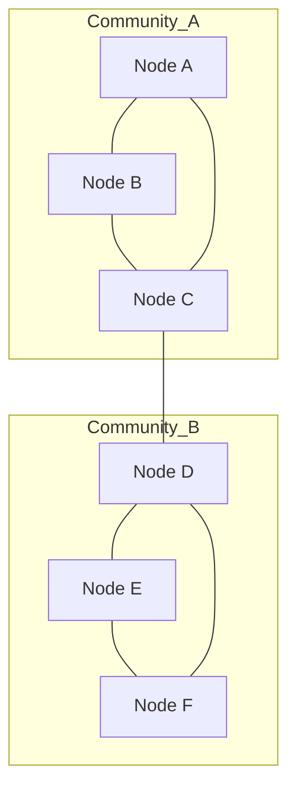

# Knowledge Graph Community Detection Explained
_Exported on 11/16/2025 at 11:36:28 GMT+08:00 from Gemini_

---

**User**

what is community detection in a knowledge graph, please?

---

**Assistant**

In a knowledge graph, community detection is the process of finding groups of nodes (entities) that are more densely connected to each other than to the rest of the graph.Think of your knowledge graph as a massive, complex web. Community detection is like finding the "clumps" or "clusters" within that web. These clusters, or communities, represent groups of entities that are highly related or share a common theme.## How It WorksA knowledge graph consists of:Nodes: These are the "things" or entities (e.g., Leonardo da Vinci, Mona Lisa, Renaissance).Edges: These are the relationships connecting the nodes (e.g., painted, was_part_of, located_in).Community detection algorithms analyze this structure to partition the graph. The main goal is to find groups where the connections within the group are strong and plentiful, while the connections between different groups are weak and sparse.## Why Is It Useful?Identifying these communities is valuable for several reasons:Topic Discovery: It can automatically reveal hidden topics or themes. For example, in a knowledge graph of scientific papers, a community might represent a specific research field.Recommendation Engines: If you and another user are in the same "community" of movie watchers (you've liked many of the same films), a recommendation engine can suggest movies you haven't seen but others in your community have.Anomaly Detection: An entity that should belong to a community but doesn't, or one that bridges many different communities in an unusual way, can be flagged as an anomaly (e.g., for fraud detection).Network Simplification: By understanding the high-level community structure, you can simplify a massive, complex graph into a more manageable one.## Common AlgorithmsSeveral algorithms are used to perform community detection, each with a different approach:Louvain Method: A popular and efficient algorithm that groups nodes in a way that maximizes a score called "modularity." High modularity means the graph has a strong community structure.Girvan-Newman Algorithm: This method works by progressively cutting the "bridges" (edges) that are most likely to connect different communities.Label Propagation: A simple and fast algorithm where nodes "adopt" the community label of the majority of their neighbors, leading to a consensus over time.In short, community detection is a powerful analytical tool that helps uncover the underlying structure and meaningful patterns hidden within a complex knowledge graph.Would you like to know more about a specific algorithm, or see more examples of how this is used in practice?

---

**User**

can you write me a simple detection algorithm in python and mermaid in markdown, within the message?

---

**Assistant**

Certainly! Here is a simple Python community detection algorithm and a Mermaid diagram, as requested.1. Simple Python Algorithm (Label Propagation)This algorithm is a minimal version of the Label Propagation Algorithm (LPA), similar to the one in your file. It's one of the simplest methods for community detection.The idea is:Give every node its own unique label (its "community").Go through each node in a random order.Have each node adopt the most frequent label of its neighbors.Repeat this process until no nodes change their label.All nodes with the same final label are a community.


```Python
import random

def simple_lpa(graph):
    """
    A very simple Label Propagation Algorithm.
    The graph is expected as a dictionary, e.g.,:
    {
        'A': ['B', 'C'],
        'B': ['A'],
        'C': ['A']
    }
    """
    
    # 1. Initialize labels: each node is its own community
    labels = {node: node for node in graph}
    
    while True:
        nodes = list(graph.keys())
        random.shuffle(nodes)
        labels_changed = False
        
        for node in nodes:
            neighbors = graph[node]
            if not neighbors:
                continue  # Skip nodes with no neighbors

            # 3. Find most common label among neighbors
            neighbor_labels = [labels[neighbor] for neighbor in neighbors]
            label_counts = {}
            for label in neighbor_labels:
                label_counts[label] = label_counts.get(label, 0) + 1
            
            # Find the most frequent label
            most_frequent_label = max(label_counts, key=label_counts.get)
            
            # 4. Update label if it's different
            if labels[node] != most_frequent_label:
                labels[node] = most_frequent_label
                labels_changed = True
        
        # 5. Stop if no labels changed (convergence)
        if not labels_changed:
            break
            
    # 6. Group nodes by final label
    communities = {}
    for node, community_id in labels.items():
        if community_id not in communities:
            communities[community_id] = set()
        communities[community_id].add(node)
        
    return list(communities.values())

# --- Example Usage ---
# A simple graph with two communities: ('A', 'B', 'C') and ('D', 'E', 'F')
simple_graph = {
    'A': ['B', 'C'],
    'B': ['A', 'C'],
    'C': ['A', 'B', 'D'], # Node 'C' is the bridge
    'D': ['C', 'E', 'F'],
    'E': ['D', 'F'],
    'F': ['D', 'E']
}

communities = simple_lpa(simple_graph)
print("Detected communities:")
for i, comm in enumerate(communities):
    print(f"Community {i+1}: {sorted(list(comm))}")
```


2. Mermaid Diagram (in Markdown)Here is a Mermaid diagram showing a simple graph with two clear communities. The subgraph syntax is used to visually group the nodes belonging to the same community.



